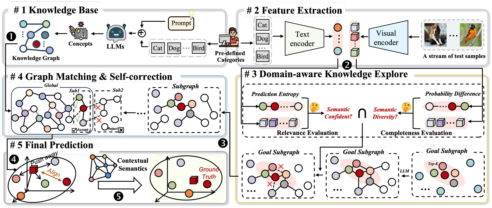

# OKGraph: Online Knowledge Graph Probing for Open-vocabulary Recognition
The official implementation of our paper "OKGraph: Online Knowledge Graph Probing for Open-vocabulary Recognition" (CVPR 2026 Findings)

## Overview


## abstract
Vision-language models (VLMs) have made significant strides in open-vocabulary recognition by aligning visual inputs with textual representations. However, most existing approaches treat categories as independent labels and rely on prompt tuning or feature adaptation, overlooking the underlying semantic structure that links related concepts. This lack of semantic connectivity limits the models’ ability to generalize, especially when the data distribution shifts or categories exhibit semantic ambiguity, where recognizing instances often depends on understanding their relationships to known concepts. We propose OKGraph (Online Knowledge Graph Probing), a dynamic framework that constructs, updates, and applies a semantic knowledge graph to guide recognition OKGraph integrates the perceptual capabilities of VLMs with the semantic reasoning of large language models (LLMs), enabling the adaptive extraction of contextual knowledge from test data. Through iterative contextual probing and model-guided correction, OKGraph refines its knowledge graph without requiring any training data or manual annotations. Extensive experiments across diverse vision tasks and domains demonstrate that OKGraph substantially improves zero-shot and few-shot performance, highlighting the value of structured reasoning in open-world vision.

The main contributions of this work are fourfold:

• We propose OKGraph, a training-free framework that enhances vision–language models for zero-shot recognition via dynamic semantic reasoning.

• We introduce a domain-aware contextual probing strategy that maintains a global scene graph and adaptively constructs goal-specific subgraphs based on prediction confidence and semantic diversity.

• We develop a self-correction mechanism that refines the knowledge graph through model feedback and blacklist-based forgetting to improve relevance and reduce noise.

• OKGraph achieves state-of-the-art performance across zero-shot and few-shot settings, demonstrating strong generalization under distribution shifts.


## Installation
```
# Clone this repo
git clone https://github.com/zenithc-git/OKGraph.git
cd OKGraph

# Create a conda enviroment
conda env create -f environment.yml
conda activate okgraph
```


## Data Format
Images are expected in an ImageFolder layout:
```
/path/to/images/
  class_0/
    img1.jpg
    ...
  class_1/
    img2.jpg
    ...
```
Pre-organized test datasets are available at [datasets](https://drive.google.com/drive/folders/1kde3BLDAC2MCOezBwjGIir0_vilz-kce?usp=drive_link)

Global scene graphs are expected in JSON:
```
/path/to/base_knowledge/
  class_0/
    ..._names.json
    ..._names_addattris.json
  class_1/
    ..._names.json
    ..._names_addattris.json
  ...
```
We provide Global scene graphs for a subset of datasets in /path/to/base_knowledge/. For datasets not included in our release, the corresponding scene graphs can be constructed by following the format of the provided examples and leveraging GPT-3.5-Turbo or other large language models.

## How to Start

```
bash scripts/run.sh
```

## Reproducibility
- Deterministic seeds are set in the evaluation loop.
- Logs are written to `logs/` with timestamped filenames.
- Evaluation outputs include `entropy_log.json` and `prediction_log.json` for analysis.

## Acknowledgement
This work was supported by the National Natural Science Foundation of China (NSFC) No. 62406037, 62441235, Guangdong Natural Science Funds for Distinguished Young Scholars (Grant 2023B1515020097), the National Research Foundation Singapore under the AI Singapore Programme (AISG Award No: AISG4-TC-2025-018-SGKR).

## Citation
If you use this code, please cite:
```
```

## License


## Acknowledgements

